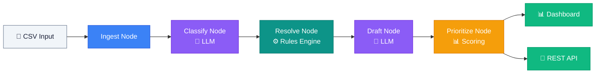

# ⚡ AP Exception Handling Agent

[](https://www.python.org/downloads/)
[](https://github.com/langchain-ai/langgraph)
[](https://fastapi.tiangolo.com/)
[](https://gradio.app/)
[](LICENSE)

> **An autonomous AP operations co-pilot** that classifies invoice exceptions, recommends resolution actions, drafts stakeholder communications, and prioritizes finance operations workload using a **hybrid AI + deterministic workflow engine**.

---

## 📑 Table of Contents

- [Features](#-features)
- [Architecture](#-architecture)
- [Tech Stack](#-tech-stack)
- [Project Structure](#-project-structure)
- [Quick Start](#-quick-start)
- [API Documentation](#-api-documentation)
- [LangGraph Workflow](#-langgraph-workflow)
- [Business Rules](#-business-rules)
- [Dashboard](#-dashboard)
- [Configuration](#-configuration)
- [Testing](#-testing)
- [Future Enhancements](#-future-enhancements)
- [Enterprise Deployment](#-enterprise-deployment)
- [License](#-license)

---

## ✨ Features

| Capability | Description |
|---|---|
| 🤖 **AI-Powered Classification** | LLM-based triage of invoice exceptions by type, severity, and root cause |
| ⚙️ **Deterministic Resolution Engine** | Rules-based resolution logic with SLA timelines and escalation routing |
| 📧 **Automated Communications** | AI-drafted stakeholder emails tailored to exception context and urgency |
| 🎯 **Priority Scoring** | Weighted scoring algorithm combining amount, age, severity, and escalation signals |
| 📊 **Executive Dashboard** | Real-time KPI cards, analytics charts, and prioritized queue visualization |
| 🔌 **REST API** | Full FastAPI backend for programmatic access and system integration |
| 📝 **Audit Trail** | Complete audit logging for compliance and traceability |
| 🛡️ **Demo Mode** | Fully functional without API keys using deterministic fallback logic |

---

## 🏗 Architecture



The agent follows a **linear LangGraph pipeline** where each node processes the full batch before passing state to the next:

1. **Ingest** — Load, validate, and structure CSV data
2. **Classify** — AI-driven exception categorization with confidence scores
3. **Resolve** — Deterministic business rules for action, ownership, and SLA
4. **Draft** — LLM-generated professional communications
5. **Prioritize** — Weighted scoring and dashboard summary generation

---

## 🛠 Tech Stack

| Component | Technology | Purpose |
|---|---|---|
| **Orchestration** | LangGraph | Stateful workflow graph execution |
| **LLM** | Anthropic Claude | Exception classification & communication drafting |
| **Models** | Pydantic v2 | Schema enforcement & validation |
| **API** | FastAPI | REST endpoints for integration |
| **Dashboard** | Gradio | Enterprise web interface |
| **Data** | Pandas | CSV processing & data manipulation |
| **Charts** | Matplotlib | Analytics visualizations |
| **Config** | python-dotenv | Environment management |
| **Testing** | pytest | Unit & integration tests |

---

## 📁 Project Structure

```
ap_exception_agent/
├── app.py                      # Main entry point
├── api.py                      # FastAPI REST application
├── requirements.txt            # Python dependencies
├── .env.example                # Environment template
│
├── config/
│   ├── settings.py             # Application settings
│   └── logging_config.py       # Logging configuration
│
├── models/
│   ├── exception_models.py     # Pydantic data models
│   └── state_models.py         # LangGraph state schema
│
├── graph/
│   ├── workflow.py             # LangGraph workflow definition
│   └── nodes/
│       ├── ingest_node.py      # CSV ingestion & validation
│       ├── classify_node.py    # LLM-based classification
│       ├── resolve_node.py     # Rules-based resolution
│       ├── draft_node.py       # Communication drafting
│       └── prioritize_node.py  # Priority scoring & summary
│
├── services/
│   ├── llm_service.py          # Anthropic LLM wrapper
│   ├── classification_service.py
│   ├── resolution_service.py
│   ├── drafting_service.py
│   └── prioritization_service.py
│
├── rules/
│   ├── resolution_rules.py     # Business resolution logic
│   └── severity_rules.py       # Severity assessment rules
│
├── utils/
│   ├── csv_loader.py           # CSV loading utilities
│   ├── validators.py           # Data validation
│   ├── formatter.py            # Table formatting
│   ├── scoring.py              # Priority scoring algorithm
│   └── helpers.py              # General utilities
│
├── ui/
│   └── dashboard.py            # Gradio enterprise dashboard
│
├── tests/
│   ├── test_classification.py  # Classification tests
│   ├── test_rules.py           # Resolution rules tests
│   └── test_priority.py        # Priority scoring tests
│
├── data/                       # CSV data files
└── output/                     # Generated output files
```

---

## 🚀 Quick Start

### Prerequisites

- Python 3.11 or higher
- An Anthropic API key (optional — demo mode works without one)

### Installation

```bash
# Clone the repository
git clone https://github.com/your-org/ap-exception-agent.git
cd ap-exception-agent

# Install dependencies
pip install -r requirements.txt

# Configure environment
cp .env.example .env
# Edit .env with your API key, or leave DEMO_MODE=true
```

### Running the Agent

```bash
# Launch the Gradio dashboard
python app.py

# Launch with FastAPI backend
python app.py --api

# Launch with public sharing link
python app.py --share

# Custom ports
python app.py --port 8080 --api --api-port 9000
```

The dashboard will be available at **http://localhost:7860** by default.

---

## 🔌 API Documentation

When running with `--api`, the FastAPI server provides Swagger docs at `/docs`.

| Method | Endpoint | Description |
|---|---|---|
| `POST` | `/upload` | Upload an AP exception queue CSV file |
| `POST` | `/run-agent` | Execute the full workflow pipeline |
| `GET` | `/summary` | Get dashboard summary from latest run |
| `GET` | `/exceptions` | Get all classified exceptions |
| `GET` | `/communications` | Get all drafted communications |
| `GET` | `/health` | Service health check |

### Example Usage

```bash
# Upload a CSV
curl -X POST -F "file=@data/sample_queue.csv" http://localhost:8000/upload

# Run the agent
curl -X POST "http://localhost:8000/run-agent?csv_path=data/sample_queue.csv"

# Get summary
curl http://localhost:8000/summary
```

---

## 🔄 LangGraph Workflow

The agent uses **LangGraph** to orchestrate a stateful, linear pipeline. Each node:

1. **Reads** from the shared `WorkflowState` (TypedDict)
2. **Processes** its batch of exceptions
3. **Returns** updated state keys for downstream nodes

```python
workflow = StateGraph(WorkflowState)

workflow.add_node("ingest", ingest)
workflow.add_node("classify", classify)
workflow.add_node("resolve", resolve)
workflow.add_node("draft", draft)
workflow.add_node("prioritize", prioritize)

workflow.set_entry_point("ingest")
workflow.add_edge("ingest", "classify")
workflow.add_edge("classify", "resolve")
workflow.add_edge("resolve", "draft")
workflow.add_edge("draft", "prioritize")
workflow.add_edge("prioritize", END)
```

**State keys**: `raw_queue`, `classified_queue`, `resolved_queue`, `drafted_communications`, `prioritized_queue`, `dashboard_summary`, `audit_log`, `errors`, `csv_path`

---

## 📏 Business Rules

### Resolution Logic

| Exception Type | Low Severity | Medium Severity | High Severity |
|---|---|---|---|
| **Price Variance** | Auto-approve (≤5%) | Manager review | Finance Controller escalation |
| **Quantity Mismatch** | Warehouse verification | Goods receipt investigation | Supply chain escalation |
| **Missing PO** | Request PO from requestor | Procurement team follow-up | Procurement Manager escalation |
| **Duplicate** | Auto-flag for review | Hold for investigation | Finance Controller review |
| **Unapproved Vendor** | Vendor Management review | Compliance check | Compliance Officer escalation |
| **GRN Not Received** | Warehouse follow-up | Receiving team investigation | Operations Manager escalation |

### Severity Assessment

- **High**: Invoice amount > $25,000 OR days outstanding > 30
- **Medium**: Invoice amount $5,000–$25,000 OR days outstanding 10–30
- **Low**: Invoice amount < $5,000 AND days outstanding < 10

### Priority Scoring

```
Score = (Amount Weight × 25) + (Age Weight × 25) + (Severity Weight × 30) + (Escalation × 20)
```

- **HIGH**: Score ≥ 70
- **MEDIUM**: 40 ≤ Score < 70
- **LOW**: Score < 40

---

## 📊 Dashboard

The enterprise dashboard provides:

- **KPI Cards** — Total exceptions, auto-resolvable count, escalations, total value, high severity count
- **Exception Classification** — Full classified queue with confidence scores
- **Priority Queue** — Ranked exceptions by priority score
- **Top 5 High Priority** — Focus view for immediate action items
- **Communications** — AI-drafted stakeholder emails
- **Analytics** — Exception type and severity distribution charts
- **Audit Log** — Complete workflow execution trail

> 📸 Screenshots available after first run

---

## ⚙️ Configuration

### Environment Variables

| Variable | Default | Description |
|---|---|---|
| `ANTHROPIC_API_KEY` | — | Anthropic API key for Claude |
| `MODEL_NAME` | `claude-3-5-sonnet-20241022` | Claude model identifier |
| `DEMO_MODE` | `true` | Run with deterministic fallbacks |
| `OUTPUT_DIR` | `output` | Directory for generated files |
| `LOG_LEVEL` | `INFO` | Logging verbosity |

### Demo Mode

When `DEMO_MODE=true` (or no API key is configured), the agent uses deterministic fallback logic for classification and drafting, enabling full functionality without LLM API access.

---

## 🧪 Testing

```bash
# Run all tests
python -m pytest tests/ -v

# Run specific test suite
python -m pytest tests/test_classification.py -v
python -m pytest tests/test_rules.py -v
python -m pytest tests/test_priority.py -v

# Run with coverage
python -m pytest tests/ -v --cov=. --cov-report=html
```

---

## 🔮 Future Enhancements

| Enhancement | Description |
|---|---|
| 🐳 **Docker** | Containerized deployment with Docker Compose |
| 📦 **Redis** | Distributed state management and caching |
| 🤖 **UiPath Integration** | RPA bridge for automated ERP actions |
| 🏢 **Multi-Tenant** | Organization-scoped data isolation |
| 🗄️ **Audit Database** | PostgreSQL-backed audit trail persistence |
| 📈 **Prometheus Metrics** | Operational monitoring and alerting |
| 🔐 **OAuth 2.0** | Enterprise SSO integration |
| 📋 **Workflow Templates** | Configurable pipeline variations |
| 🌐 **Webhook Notifications** | Real-time event callbacks |
| 📧 **Email Integration** | Direct SMTP sending for approved drafts |

---

## 🏭 Enterprise Deployment

### Docker (Coming Soon)

```bash
docker build -t ap-exception-agent .
docker run -p 7860:7860 -p 8000:8000 \
  -e ANTHROPIC_API_KEY=your-key \
  ap-exception-agent
```

### Kubernetes

```yaml
apiVersion: apps/v1
kind: Deployment
metadata:
  name: ap-exception-agent
spec:
  replicas: 2
  template:
    spec:
      containers:
      - name: agent
        image: ap-exception-agent:latest
        ports:
        - containerPort: 7860
        - containerPort: 8000
        env:
        - name: ANTHROPIC_API_KEY
          valueFrom:
            secretKeyRef:
              name: agent-secrets
              key: api-key
```

### Production Considerations

- Use a reverse proxy (nginx/Traefik) for TLS termination
- Configure health check endpoints for load balancer probes
- Set `DEMO_MODE=false` and provide a valid API key
- Mount persistent volume for `data/` and `output/` directories
- Set `LOG_LEVEL=WARNING` for production noise reduction

---

## 📄 License

This project is licensed under the **MIT License**. See [LICENSE](LICENSE) for details.

---

<p align="center">
  <strong>Built with ❤️ for enterprise finance operations</strong><br/>
  <sub>Powered by LangGraph · Anthropic Claude · FastAPI · Gradio</sub>
</p>
